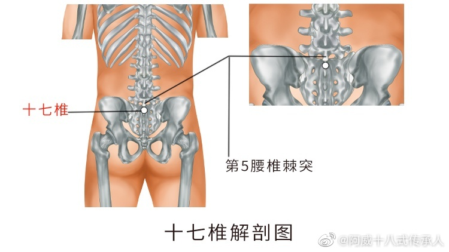
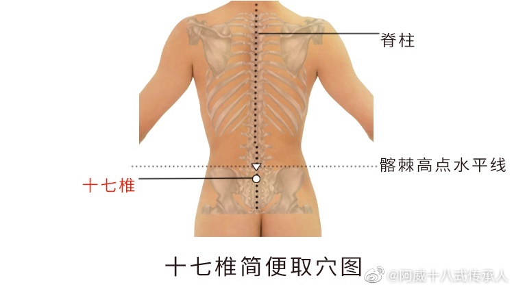

# 圈内指南-姨妈痛缓解方法指南

# 
姨妈痛缓解方法指南

**方法一：**

&emsp;&emsp;​喝一喝四物汤。配方是：生/熟地黄、当归、白术、川穹，还可以加点红枣红糖改善口味。要注意的是虚寒体质的要用熟地黄；热性体质的容易爆痘的要用生地黄。保险起见可以一半一半，具体分量根据自己的情况适当调节。而且还有很多针对具体情况的衍生配方。注意，四物汤是在姨妈的间隔期喝的，姨妈已经到访的时候不要喝。

​

**​方法二：**

&emsp;&emsp;​揉按十七椎穴，基本可以很快见效。穴位位置在腰部，当后正中线上，第5腰椎棘突下。穴位图如下：​
 
 

&emsp;&emsp;​寻找此穴时，可以用手压一压，如果有明显的痛感，就是找对了位置。操作时，用拇指指关节加点力度，按揉该穴3—5分钟，感觉有轻微的痛感为度，不能只按，一定还要揉，才能让血脉畅通，疼痛才能缓解。
