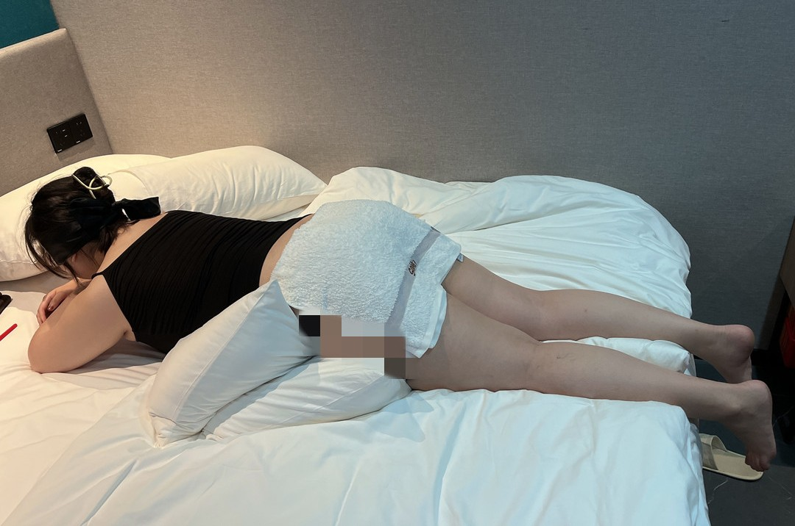
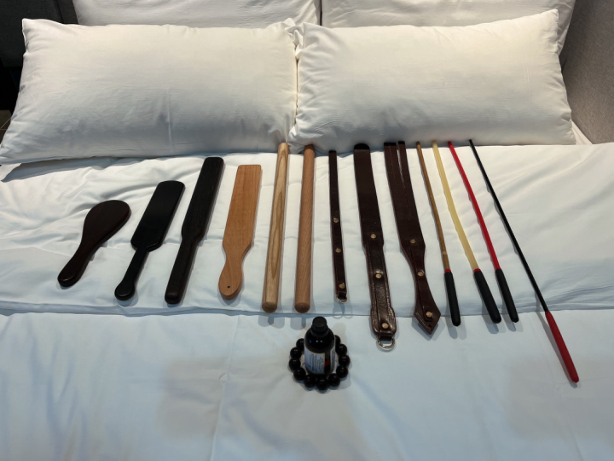
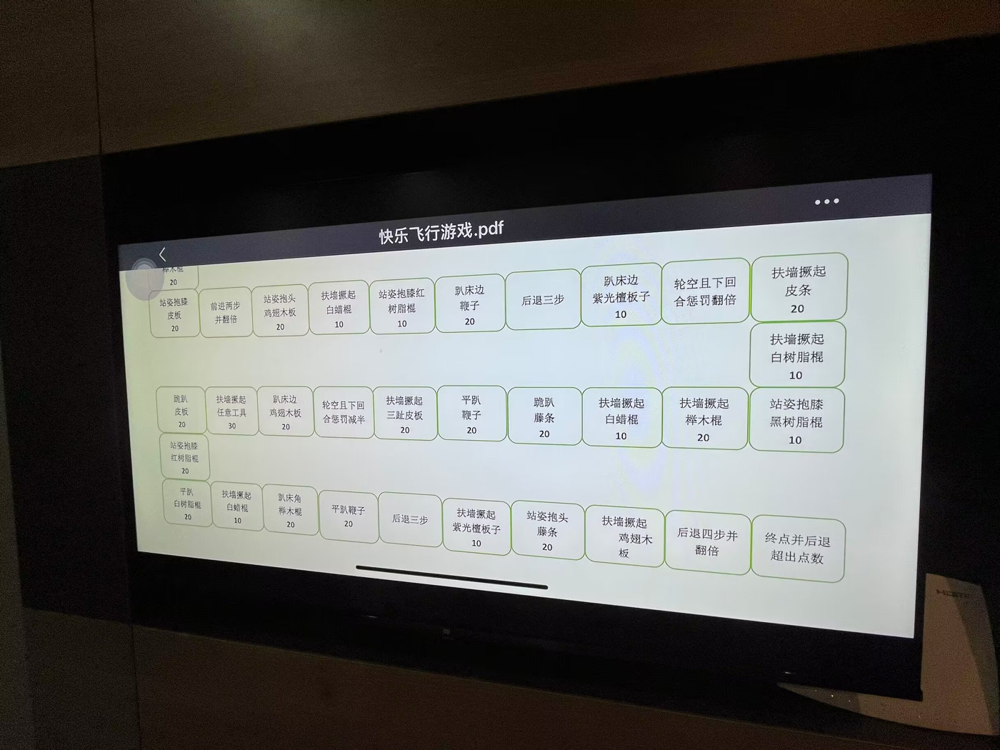

# 实践记录2022-008

# 
Form of Spanking Execution / 实践活动记录 2022-008

<table>
    <tr>
        <td><b>Spanker/执行人</b></td>
        <td>1552919196</td>
        <td><b>Spankee/被执行人</b></td>
        <td>84XXXXX46</td>
    </tr>
    <tr>
        <td><b>Spanking Time/执行时间</b></td>
        <td>14:30-18:30，Aug 13rd 2022</td>
        <td><b>Spankee's Height/被执行人身高</b></td>
        <td>164cm</td>
    </tr>
    <tr>
        <td rowspan=2><b>Spanking Place/执行地点</b></td>
        <td rowspan=2>花美时民宿(大屯地铁站店)</td>
        <td><b>Spankee's Weight/被执行人体重</b></td>
        <td>保密</td>
    </tr> 
    <tr>
        <td><b>Spankee's Butt Type/被执行人臀部类型</b></td>
        <td>脂肪型</td>
    </tr>
    <tr>
        <td><b>Package Selection/项目选择</b></td>
        <td style="text-align: center;">B</td>
        <td colspan =2>
        A. Discipline & Punishment/管教惩罚

B. Fascinating Games/快乐游戏

C. Role Play/角色扮演

D. Greenhand Guide/新手上路
        </td>
    </tr>
    <tr>
        <td><b>Tools/工具</b></td>
        <td colspan=3>热身手板1只，木板子3只，木棍2根，皮工具3只，藤条类4根</td>
    </tr>
    <tr>
        <td><b>Notes/注意事项</b></td>
        <td colspan=3>无</td>
    </tr>
    <tr>
        <td><b>Spanker's Review/执行人评价</b></td>
        <td colspan=3>&emsp;&emsp;这次预约实践活动的是一位长得很像“盗月社”里面的“杨树梢”的姑娘，而且也是首位选择项目B：快乐游戏的姑娘。这是一位体态丰腴的姑娘，皮肤如羊脂玉般白嫩且有弹性，是绝佳的实践对象。为了这次快乐游戏，我还特意赶制了一份可以尽量利用现有工具的飞行棋图。按照约定的实践，我又来到了这家很有意思的民宿酒店。

&emsp;&emsp;我为这次实践活动准备了两项“快乐游戏”。首先是蒙眼猜工具。然后是快乐飞行棋。仔细地涂油热身之后，小姑娘主动把眼睛用黑丝带蒙上了，在脑后打了一个漂亮的蝴蝶结，然后乖乖地趴在了高高摞起的枕头上。蒙眼猜工具的规则是先让姑娘看一看要用到的工具，然后挑出某一样工具触碰一下姑娘，或者打一下。姑娘凭借刚才的触感或者痛感猜测该工具是什么，猜错了惩罚10下并继续猜，每错一次打10下，50下封顶。刚开始的时候由于对工具不熟悉，所以小姑娘频频猜错，因此经常每样工具要挨二三十下，但是很快她的准确率就直线上升了，有几样工具只挨了一下就猜出来了，完全没有发挥的机会啊，这肯定不行。于是我抽出一根树脂藤条，用包了橡胶把手的那一端触碰了姑娘的屁股一下，她果然没猜出来，10下入账了，又用把手那端打了一下，又猜错了，good，20了。虽然由于范围逐渐缩小导致她下一次就猜对了，但还是证明这招的确好使。然后我又拿起了鸡翅木板子故技重施，用把手那端触碰了姑娘一下，果然没猜对，又用板子的边儿打了一下，她居然猜成了藤条……最终小姑娘喜提30下。于是房间里就回荡起了清脆的拍击声，急促的呼痛声，还有柔美的音乐声。

&emsp;&emsp;第二个游戏开始的时候，我把快乐飞行棋游戏图投屏到了电视上，然后把骰子放进杯子里让小姑娘自己决定自己的命运。最初的几步姑娘的运气不好，点数总是在3以下徘徊，好在每一步的数量大多都是10下，但她的屁股也开始出痧了，星星点点像燎原的火焰一样美丽。之后几步运气开始眷顾她了，摇除了好几次6点，因此很快就来到最后两行了，殊不知她的噩梦才刚刚开始。因为最后有几个后退格，而且结束那格写着如果点数超出则退后相应点数，于是小姑娘就掉进了最后一行的陷阱，来回挣扎，每次即将到达终点的时候，下一步就会因为超出点数而后退，有时候甚至恰好后退到了还需要后退的格子。几次之后，她的屁股越来越红，越来越疼，也越来越绝望得想哭，所以我决定打完最后20板子之后就结束这个“快乐”的游戏。最后的20下用了十几分钟，每打一下我都会引导她深呼吸，放松身体，最后她大汗淋漓地坚持到了结束，没哭，但她说像做了有氧运动一样累。

&emsp;&emsp;嗯，这次的"快乐游戏"的确很快乐。
        </td>
    </tr>
    <tr>
        <td><b>Spankee's Review/被执行人评价 </b></td>
        <td colspan=3>&emsp;&emsp;妈妈我上电视啦！（不是）

&emsp;&emsp;​家人们这小⭕男主比大⭕S可变态/恶趣味多了。工具专业且重度，堪比军事化武器。有跟擀面杖一样粗的木棍，还有个专业名词叫白蜡棍（这名字听起来挺人畜无害的，但杀伤力惊人:sob:）还有跟洗衣棒槌一样厚的木板子:sob:

&emsp;&emsp;蒙眼猜工具是我等健忘星人的噩梦，夹杂着大量的语言陷阱，根本防不胜防啊。材质粗细相似的工具根本猜不出来只能靠蒙，蒙的结果就是几乎每次都挨打，真的栓Q。

&emsp;&emsp;飞行棋简直是噩梦2.0。由于点子比较背…几乎错过了所有相对比较轻的工具，挨得最轻的工具居然是带皮藤条！！BTW从未想过藤条后面那个皮质还是橡胶的把手也能成为揍人工具:sob:这跟用皮带金属扣那边抽人有啥区别:sob:（夸张手法

&emsp;&emsp;挨揍过程中背景音乐有一段孤独的牧羊人（好像是我被打蒙了记不太清了。挥鞭的手速明显快了起来似乎是在用我的屁股打节拍。我都不敢回头怕看到变态的笑容:sob:

&emsp;&emsp;​由于飞行棋的最后一步设计的太过于变态，叠加了我点子背的buff，导致多挨了近百下暴击，每下感觉都是砸下来的（但威哥说他没用力（真的吗我不信。这也让本铁骨铮铮获得了挨揍史上第一次差点哭出来的经验。

&emsp;&emsp;因为个人不喜欢在实践中哭出来，所以在崩溃边缘的时候及时喊停缓缓，威哥也非常贴心的帮我转移注意力聊起了其他话题，很快状态就调整好了。这点需要点个👍，威哥是真的能观察到被动的状态及时作出调整的。接下来的实践明显感觉威哥的力度和节奏有所调整，从80%暴击率直降到40%，让我们一起说，谢谢威哥。

&emsp;&emsp;你别看威哥下手狠，但也是真的认真负责。见多了拿个皮带敢抽人就自称是s的人，威哥这样细致认真的对待打屁股这件事的主动绝对是凤毛麟角的存在。反正我入圈多年，第一次遇到事前会热身，中途抹油，事后还有冷敷的主动。有想法的小贝可以无脑冲了，绝对会让你有一个绝佳的体验。

&emsp;&emsp;由于没听劝坚持坐车回家又遇到了周末大堵车，久坐导致屁股从边缘开始迅速变紫，现在已经不能看了:joy:，朋友们听人劝吃饱饭啊，胖揍完别久坐啊。

​Ps：
&emsp;&emsp;​刚结束时看起来居然只是泛红，没有青紫或者破皮的情况，不得不说手艺人名不虚传啊，抹油也是真有用。

&emsp;&emsp;估计飞行棋会被改良，有喜欢重度的小伙伴可以选择我用的这个版本，一定可以满足你emmmmm

&emsp;&emsp;家人们一定要事前沟通清楚选择哪个套餐啊，搞了个乌龙差点没给我打die了:sob:

&emsp;&emsp;选择快乐游戏套餐嘴上也得有把门的啊，否则会因为嘴比脑子快获得游戏以外的“额外奖励”:sob:</td>
    </tr>
</table>

|**Gallary**|
|---|
|

|
